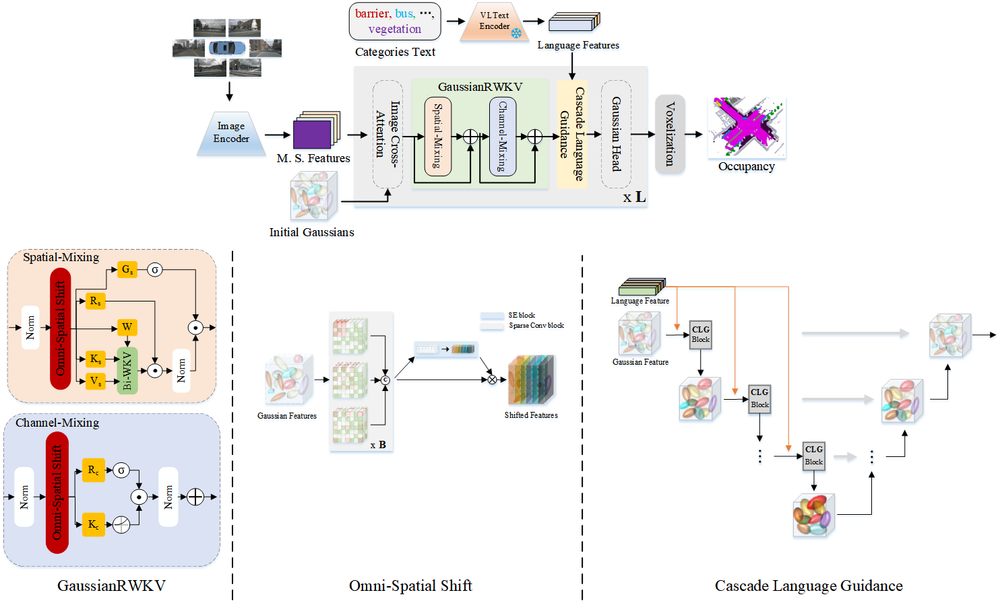
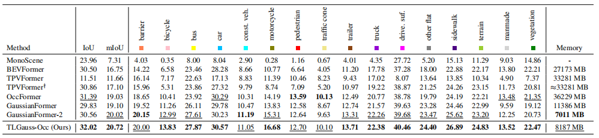

## TLGauss-Occ: Topology-Aware and Language-Guided 3D Gaussians for Semantic Occupancy Prediction
### News
- [2025/12/22]: Demo release.

### Introduction

### Demo

### Benchmark Results


### Getting Started
[1] Installation <br>
```
conda create -n tlgocc python=3.8     
conda activate tlgocc
pip install torch==2.0.0 torchvision==0.15.1 torchaudio==2.0.1 --index-url https://download.pytorch.org/whl/cu118
pip install git+https://github.com/openai/CLIP.git
pip install openmim
mim install mmcv==2.0.1
mim install mmdet==3.0.0
mim install mmsegmentation==1.0.0
mim install mmdet3d==1.1.1
```
[2] Data Preparation. <br>
Please download the **nuScenes full dataset v1.0** from the [official website](https://www.nuscenes.org/download) and obtain the occupancy annotations from [SurroundOcc](https://github.com/weiyithu/SurroundOcc). The dataset directory structure is as follows:
```
TLGauss-Occ
├── ...
├── data/
│   ├── nuscenes_infos_train_sweeps_occ.pkl
│   ├── nuscenes_infos_val_sweeps_occ.pkl
│   ├── nuscenes/
│   │   ├── maps/
│   │   ├── samples/
│   │   ├── sweeps/
│   │   ├── v1.0-test/
|   |   ├── v1.0-trainval/
│   ├── nuscenes_occ/
│   │   ├── samples/
│   │   |   ├── xxxxxxxx.pcd.bin.npy
│   │   |   ├── ...
```

### Train

### Eval

### Acknowledgement
This project is built upon the pioneering work of [GaussianFormer](https://github.com/huang-yh/GaussianFormer), [Vision-RWKV](https://github.com/OpenGVLab/Vision-RWKV), and [RWKV-LM](https://github.com/RWKV/RWKV-LM). We extend our gratitude to these projects for their contributions to the community.
